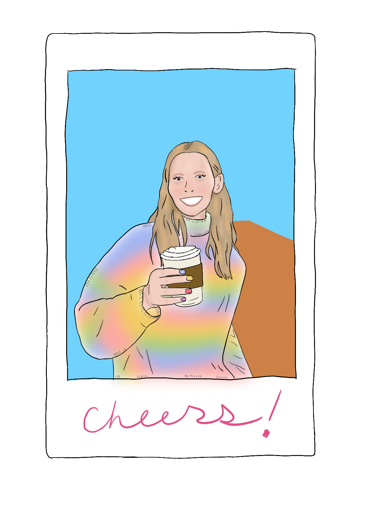

<a name="readme-top"></a>

<!-- PROJECT LOGO -->
<br />
<div align="center">
  <!-- <a href="https://github.com/ahuisinga/portfolio-site">
    
  </a> -->

<h1 align="center">annahuisinga.com</h1>

  <p align="center">
    built with <a href="https://nextjs.org/">Next.js</a> and hosted with <a href="https://vercel.com">Vercel</a>
  </p>
</div>

[![Forks][forks-shield]][forks-url]
[![Stargazers][stars-shield]][stars-url]
[![MIT License][license-shield]][license-url]
[![LinkedIn][linkedin-shield]][linkedin-url]

<!-- TABLE OF CONTENTS -->
<details>
  <summary>Table of Contents</summary>
  <ol>
    <li>
      <a href="#about-the-project">About The Project</a>
      <ul>
        <li><a href="#built-with">Built With</a></li>
      </ul>
    </li>
    <li><a href="#license">License</a></li>
    <li><a href="#contact">Contact</a></li>
    <li><a href="#acknowledgments">Acknowledgments</a></li>
  </ol>
</details>

<!-- ABOUT THE PROJECT -->

## About The Project

[![My Portfolio Screen Shot][product-screenshot]](https://example.com)

<p>
Welcome to my personal portfolio website! CSS and UI design are not my biggest strength, so this has been a fun project to practice those skills more. On this site, you can find out a bit about me and see an overview of my current side projects.
</p>
<p align="right">(<a href="#readme-top">back to top</a>)</p>

### Built With

- [![Next][Next.js]][Next-url]
- [![React][React.js]][React-url]
- [![TypeScript][TypeScript.com]][TypeScript-url]
- [![TailwindCSS][TailwindCSS.com]][TailwindCSS-url]
- [![HeadlessUI][HeadlessUI]][HeadlessUI-url]

<p align="right">(<a href="#readme-top">back to top</a>)</p>

## Usage

If for whatever reason you want to fork this repo for your own designs, have at it. I just ask that if you are simply copying and pasting your own info into it or using some of my components, like the custom Typewriter animation, kindly give some credit back here.

<p align="right">(<a href="#readme-top">back to top</a>)</p>

<!-- GETTING STARTED -->

## Getting Started

To get a local copy up and running follow these steps.

### Prerequisites

- Install node and npm
  - Verify installation
  ```bash
  npm -v
  ```
  ```bash
  node -v
  ```

### Starting a development instance

1. Fork and clone the repo

```bash
git clone https://github.com/<yourUserNameHere>/portfolio-site.git
```

2. Install dependencies

```bash
npm install
```

3. Start a dev server

```bash
npm run dev
```

4. It should open up on http://localhost:3000. Depending on what else you have running, it might be a different port.

<p align="right">(<a href="#readme-top">back to top</a>)</p>

<!-- CONTACT -->

## Contact

Anna Huisinga

Project Link: [https://github.com/ahuisinga/portfolio-site](https://github.com/ahuisinga/portfolio-site)

<p align="right">(<a href="#readme-top">back to top</a>)</p>

<!-- ACKNOWLEDGMENTS -->

## Acknowledgments

- In my perusal of other portfolio sites out there, there are a few I found pretty cool and drew inspiration from. Hope they don't mind if I promote them here.
  - [brittanychiang.com](https://brittanychiang.com)
  - [benscott.dev](https://benscott.dev/)
- Inspo for my own Typewriter animation: [3 ways to implement a typing animation in React](https://blog.logrocket.com/3-ways-implement-typing-animation-react/#multiline-typing-animation-react-type-animation)
- My icons come from:
  - [HeroIcons](https://heroicons.com/)
  - [Icons8](https://icons8.com)

<p align="right">(<a href="#readme-top">back to top</a>)</p>

[forks-shield]: https://img.shields.io/github/forks/ahuisinga/portfolio-site.svg?style=for-the-badge
[forks-url]: https://github.com/ahuisinga/portfolio-site/network/members
[stars-shield]: https://img.shields.io/github/stars/ahuisinga/portfolio-site.svg?style=for-the-badge
[stars-url]: https://github.com/ahuisinga/portfolio-site/stargazers
[license-shield]: https://img.shields.io/github/license/ahuisinga/portfolio-site.svg?style=for-the-badge
[license-url]: https://github.com/ahuisinga/portfolio-site/blob/master/LICENSE.txt
[linkedin-shield]: https://img.shields.io/badge/-LinkedIn-black.svg?style=for-the-badge&logo=linkedin&colorB=555
[linkedin-url]: https://linkedin.com/in/annahuisinga
[product-screenshot]: public/images/portfolio_screenshot.png
[Next.js]: https://img.shields.io/badge/next.js-000000?style=for-the-badge&logo=nextdotjs&logoColor=white
[Next-url]: https://nextjs.org/
[React.js]: https://img.shields.io/badge/React-20232A?style=for-the-badge&logo=react&logoColor=61DAFB
[React-url]: https://reactjs.org/
[Vue.js]: https://img.shields.io/badge/Vue.js-35495E?style=for-the-badge&logo=vuedotjs&logoColor=4FC08D
[Vue-url]: https://vuejs.org/
[Angular.io]: https://img.shields.io/badge/Angular-DD0031?style=for-the-badge&logo=angular&logoColor=white
[Angular-url]: https://angular.io/
[Svelte.dev]: https://img.shields.io/badge/Svelte-4A4A55?style=for-the-badge&logo=svelte&logoColor=FF3E00
[Svelte-url]: https://svelte.dev/
[Laravel.com]: https://img.shields.io/badge/Laravel-FF2D20?style=for-the-badge&logo=laravel&logoColor=white
[Laravel-url]: https://laravel.com
[Bootstrap.com]: https://img.shields.io/badge/Bootstrap-563D7C?style=for-the-badge&logo=bootstrap&logoColor=white
[Bootstrap-url]: https://getbootstrap.com
[JQuery.com]: https://img.shields.io/badge/jQuery-0769AD?style=for-the-badge&logo=jquery&logoColor=white
[JQuery-url]: https://jquery.com
[TailwindCSS.com]: https://img.shields.io/badge/tailwindcss-white?style=for-the-badge&logo=tailwindcss&logoColor=06B6D4
[TailwindCSS-url]: https://tailwindcss.com
[TypeScript.com]: https://img.shields.io/badge/typescript-%233178C6?style=for-the-badge&logo=typescript&logoColor=white
[TypeScript-url]: https://www.typescriptlang.org/
[HeadlessUI]: https://img.shields.io/badge/headless_ui-%2366E3FF?style=for-the-badge&logo=headlessui&logoColor=white
[HeadlessUI-url]: https://headlessui.com/v1
